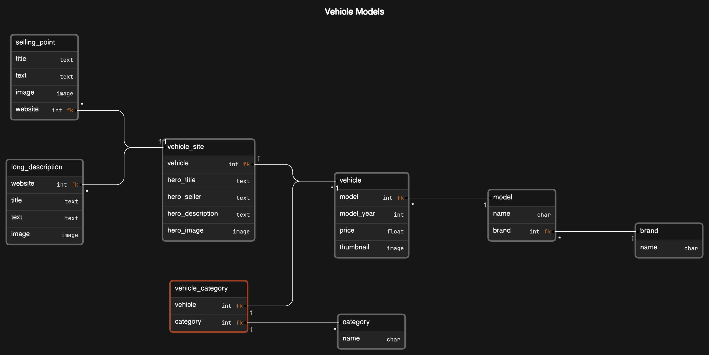

# ego-challenge

[Ver en español](README_ES.md)

## How to run the project

### 1. Dependencies

You need a Python environment with `Django 5.0.3`, `Django REST Framework 3.14` and `Pillow 10.2` installed.
I use `pipenv`, a tool that manages this.

If you have `pipenv` installed (only available on Linux) navigate to the repository folder and run the next commands:

> \$ `pipenv update`\
> \$ `pipenv shell`

This will create the virtual environment with the dependencies installed.

If you don't want (or can't) to use `pipenv`, the `requirements.txt` file sould help you set up the project using another tool.

### 2. Running the server

Once you set up the dependencies, just run the command:

> \$ `python ./project/manage.py runserver`

Open your browser and go to http://localhost:8080/

## Information

### Vehicle Models

### Root / Admin
The root url redirects you to the admin to make changes in the data 
http://localhost:8080/ -> http://localhost:8080/admin/

### API List View
http://localhost:8080/api/vehicle/

### API Vehicle Details
http://localhost:8080/api/vehicle/12/  
(12 is the only vehicle with "vehiclesite")

### Filters
"Autos"  
http://localhost:8080/api/vehicle/?filter=autos

"Pickups y comerciales"  
http://localhost:8080/api/vehicle/?filter=pickups,comerciales

"SUVs y Crossovers"  
http://localhost:8080/api/vehicle/?filter=suvs,crossovers

### Order
Lower to higher price  
http://localhost:8080/api/vehicle/?order=price

Higher to lower price  
http://localhost:8080/api/vehicle/?order=price&reverse

Newest first  
http://localhost:8080/api/vehicle/?order=year

Oldest first  
http://localhost:8080/api/vehicle/?order=year&reverse

## My development environment

- Python Virtual Env.: `pipenv`
- Python Dependencies: `pipenv`
- Editor: `Visual Studio Code`
- O.S.: `Manjaro Linux (arch)`

## Details
For this challenge, I structured things differently than I would typically do, as the objectives are specific and isolated, removing the need to consider the security and scalability of the project. However, it seems interesting to mention the following:
- There is no structured configuration, and I did not take into account the necessary details for working in production.
- The design of the models (the database) is simple to meet the requirements.
- No testing code was written; it was simply tested manually.
